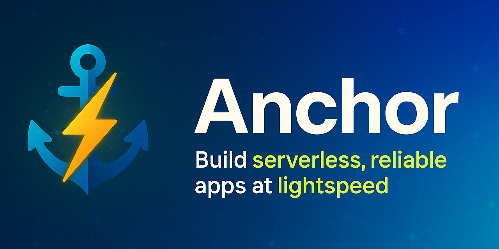

# ⚓ Anchor

English | [中文](README.zh.md)



Build serverless, reliable apps at lightspeed ⚡ — with confidence 🛡️.

### Highlights ✨

- **YAML-first, codegen-backed**: Define HTTP and task schemas in YAML; Anchor generates strongly-typed interfaces so missing implementations fail at compile time, not in prod.
- **Async tasks you can trust**: At-least-once delivery, automatic retries, and cron scheduling out of the box.
- **Transaction-safe flows**: A `WithTx` pattern ensures hooks always run and side effects are consistent.
- **Typed database layer**: Powered by `sqlc` for safe, fast queries.
- **Fast HTTP server**: Built on Fiber for performance and ergonomics.
- **AuthN/Z built-in**: Macaroons-based authentication and authorization.
- **Pluggable architecture**: First-class plugin system for clean modularity.
- **Ergonomic DI**: Wire-based dependency injection keeps code testable and explicit.

### Why Anchor? (The problem it solves) 🤔

- **Glue-code fatigue**: Many teams stitch HTTP, DB, tasks, DI, and auth by hand, leaving implicit contracts and runtime surprises. Anchor makes those contracts explicit and generated.
- **Background jobs are hard**: Idempotency, retries, and delivery guarantees are non-trivial. Anchor ships a task engine with at-least-once semantics and cron.
- **Consistency across boundaries**: Keep handlers, tasks, and hooks transactional using `WithTx` so invariants hold.
- **Confidence and testability**: Every generated interface is mockable; behavior is easy to test.

### Key advantages 🏆

- **Compile-time confidence**: Schema → interfaces → concrete implementations you cannot forget to write.
- **Productivity**: `anchor init` + `anchor gen` reduces boilerplate and wiring.
- **Extensibility**: Clean plugin boundaries and event-driven architecture.
- **Predictability**: Singletons for core services, DI for clarity, and well-defined lifecycles.

## Architecture 🏗️

Anchor helps you build quickly while staying scalable and production‑ready.

- **Single PostgreSQL backbone**: One PostgreSQL database powers both transactional business logic and the durable task queue, keeping state consistent and operations simple. For many products, a well‑provisioned instance (e.g., 32 vCPU) goes a very long way.
- **Stateless application nodes**: HTTP servers are stateless and horizontally scalable; you can run multiple replicas without coordination concerns.
- **Task queue as integration fabric**: Use async tasks to decouple modules. For example, when a payment completes, enqueue an `OrderFinished` task and do any factory‑module inserts in its handler—no factory logic inside the payment module.
- **Built‑in worker, flexible deployment**: Anchor includes an async task worker. Run it in‑process, as separate long‑running workers, or disable it for serverless HTTP (e.g., AWS Lambda) while keeping workers on regular servers.
- **Monolith, not microservices**: Anchor favors a pragmatic, scalable monolith and is not aimed at multi‑million QPS microservice fleets.

These choices maximize early velocity and give you a clear, reliable path to scale with confidence.

## Quick start 🚀

```bash
go install github.com/cloudcarver/anchor/cmd/anchor@latest
anchor init . github.com/my/app
anchor gen
```

## Hands-on: try it now 🧑‍💻

```bash
# 1) Scaffold into folder 'demo'
anchor init demo github.com/you/demo

# 2) Generate code (can be re-run anytime)
cd demo
anchor gen

# 3) Start the stack (DB + API + worker)
docker compose up
```

In another terminal:

```bash
curl http://localhost:2910/api/v1/counter
# Optional sign-in if your template includes auth
curl -X POST http://localhost:2910/api/v1/auth/sign-in -H "Content-Type: application/json" -d '{"name":"test","password":"test"}'
```

## One‑minute tour 🧭

1) Define an endpoint (OpenAPI YAML) 🧩

```yaml
paths:
  /api/v1/counter:
    get:
      operationId: getCounter
```

2) Define a task ⏱️

```yaml
tasks:
  incrementCounter:
    description: Increment the counter value
    cron: "*/1 * * * *"
```

3) Generate and implement 🛠️

```bash
anchor gen
```

```go
func (h *Handler) GetCounter(c *fiber.Ctx) error {
  return c.JSON(apigen.Counter{Count: 0})
}
```

## Showcase: unique features 🧰

### OpenAPI-powered middleware (no DSL)
```yaml
x-check-rules:
  OperationPermit:
    useContext: true
    parameters:
      - name: operationID
        schema:
          type: string
  ValidateOrgAccess:
    useContext: true
    parameters:
      - name: orgID
        schema:
          type: integer
          format: int32

paths:
  /orgs/{orgID}/projects/{projectID}:
    get:
      operationId: GetProject
      security:
        - BearerAuth:
            - x.ValidateOrgAccess(c, orgID, "viewer")
            - x.OperationPermit(c, operationID)
```

### Security scheme (JWT example)
```yaml
components:
  securitySchemes:
    BearerAuth:
      type: http
      scheme: bearer
      bearerFormat: macaroon
```

### Async tasks: at-least-once, retries, cron
```yaml
# api/tasks.yaml
tasks:
  - name: SendWelcomeEmail
    description: Send welcome email to new users
    parameters:
      type: object
      required: [userId, templateId]
      properties:
        userId:
          type: integer
          format: int32
        templateId:
          type: string
    retryPolicy:
      interval: 5m
      maxAttempts: 3
    cron: "0 * * * *"
```

```go
// Enqueue outside a tx
taskID, _ := taskrunner.RunSendWelcomeEmail(ctx, &taskgen.SendWelcomeEmailParameters{
  UserId: 123, TemplateId: "welcome",
}, taskcore.WithUniqueTag("welcome-email:123"))
```

```go
// Enqueue atomically with your business logic
_ = model.RunTransactionWithTx(ctx, func(tx pgx.Tx, txm model.ModelInterface) error {
  // ... create user ...
  _, err := taskrunner.RunSendWelcomeEmailWithTx(ctx, tx, &taskgen.SendWelcomeEmailParameters{
    UserId: user.ID, TemplateId: "welcome",
  })
  return err
})
```

### Transactions: compose everything with WithTx
```go
func (s *Service) CreateUserWithTx(ctx context.Context, tx pgx.Tx, username, password string) (int32, error) {
  txm := s.model.SpawnWithTx(tx)
  userID, err := txm.CreateUser(ctx, username, password)
  if err != nil { return 0, err }
  if err := s.hooks.OnUserCreated(ctx, tx, userID); err != nil { return 0, err }
  _, err = s.taskRunner.RunSendWelcomeEmailWithTx(ctx, tx, &taskgen.SendWelcomeEmailParameters{ UserId: userID })
  return userID, err
}
```

### Dependency injection with Wire
```go
func NewGreeter(m model.ModelInterface) (*Greeter, error) { return &Greeter{Model: m}, nil }
```

```go
func InitApp() (*app.App, error) {
  wire.Build(model.NewModel, NewGreeter /* ...other providers... */)
  return nil, nil
}
```

### Typed SQL with sqlc
```sql
-- name: GetCounter :one
SELECT value FROM counter LIMIT 1;

-- name: IncrementCounter :exec
UPDATE counter SET value = value + 1;
```

## Running async tasks ⚙️

```go
// Trigger the incrementCounter task
taskID, err := taskrunner.RunIncrementCounter(ctx, &taskgen.IncrementCounterParameters{})
if err != nil {
  // handle error
}
```

Tasks run with at-least-once delivery guarantees and automatic retries based on your retry policy. You can also schedule tasks via cron expressions in `api/tasks.yaml`.

## Advanced: Custom initialization 🧩

You can run custom logic before the app starts by providing an `Init` function:

```go
// Runs before the application starts
func Init(anchorApp *anchor_app.Application, taskrunner taskgen.TaskRunner, myapp anchor_app.Plugin) (*app.App, error) {
    if err := anchorApp.Plug(myapp); err != nil {
        return nil, err
    }

    if _, err := anchorApp.GetService().CreateNewUser(context.Background(), "test", "test"); err != nil {
        return nil, err
    }
    if _, err := taskrunner.RunAutoIncrementCounter(context.Background(), &taskgen.AutoIncrementCounterParameters{
        Amount: 1,
    }, taskcore.WithUniqueTag("auto-increment-counter")); err != nil {
        return nil, err
    }

    return &app.App{ AnchorApp: anchorApp }, nil
}
```

To customize how the Anchor application is constructed, override `InitAnchorApplication`:

```go
func InitAnchorApplication(cfg *config.Config) (*anchor_app.Application, error) {
    anchorApp, err := anchor_wire.InitializeApplication(&cfg.Anchor, anchor_config.DefaultLibConfig())
    if err != nil {
        return nil, err
    }
    return anchorApp, nil
}
```

Need more dependencies inside `Init`? Add them as parameters (e.g., `model.ModelInterface`) and run `anchor gen`.

## Documentation 📚

- **Transaction Management**: [docs/transaction.md](docs/transaction.md) ([中文](docs/transaction.zh.md))
- **Middleware (x-functions & x-check-rules)**: [docs/middleware.md](docs/middleware.md) ([中文](docs/middleware.zh.md))
- **Async Tasks**: Tutorial [docs/async-tasks-tutorial.md](docs/async-tasks-tutorial.md) · Tech reference [docs/async-tasks-technical.md](docs/async-tasks-technical.md) ([中文](docs/async-tasks-tutorial.zh.md), [中文](docs/async-tasks-technical.zh.md))

## Examples 🧪

- `examples/simple` — minimal end-to-end sample with HTTP, tasks, DI, and DB.


