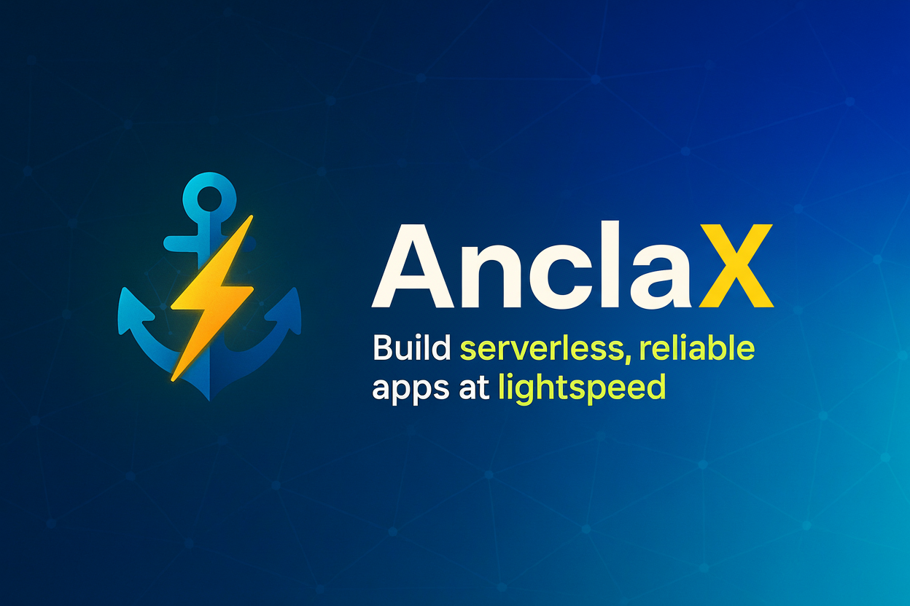

# ⚓ Anclax
[](https://deepwiki.com/cloudcarver/anclax)

English | [中文](README.zh.md)



Build serverless, reliable apps at lightspeed ⚡ — with confidence 🛡️.

Anclax is a definition‑first framework for small–medium apps (single PostgreSQL). Define APIs and tasks as schemas; generated code moves correctness to compile time.

Join our [Discord server](https://discord.gg/XxXXbyF59H).

Contact: mike@anclax.com

### Recommended setup

1. Install the Anclax CLI:

  ```bash
  go install github.com/cloudcarver/anclax/cmd/anclax@latest
  ```

2. Bootstrap a new project (installs toolchain + runs codegen):

  ```bash
  anclax init myapp github.com/me/myapp
  cd myapp
  ```

3. For existing repos (or after changing `anclax.yaml`), sync tools and regenerate:

  ```bash
  anclax install
  anclax gen
  ```

  External tools are installed into `.anclax/bin` for reproducible builds.

4. Optional: add the Anclax skill to your coding agent:

  ```bash
  npx skills add cloudcarver/anclax
  ```


### Highlights ✨

- **YAML-first, codegen-backed**: Define HTTP and task schemas in YAML; Anclax generates strongly-typed interfaces so missing implementations fail at compile time, not in prod.
- **Async tasks you can trust**: At-least-once delivery, automatic retries, cron scheduling, plus priority/weight lanes you can tune at runtime.
- **Serial task execution**: Use `taskcore.WithSerialKey`/`WithSerialID` to run related tasks strictly one-by-one.
- **Transaction-safe flows**: A `WithTx` pattern ensures hooks always run and side effects are consistent.
- **Typed database layer**: Powered by `sqlc` for safe, fast queries.
- **Fast HTTP server**: Built on Fiber for performance and ergonomics.
- **AuthN/Z built-in**: Macaroons-based authentication and authorization.
- **Pluggable architecture**: First-class plugin system for clean modularity.
- **E2E scenarios as code**: Describe distributed flows in DST YAML and generate typed runners.
- **Ergonomic DI**: Wire-based dependency injection keeps code testable and explicit.

### Why Anclax? (The problem it solves) 🤔

- **Glue-code fatigue**: Many teams stitch HTTP, DB, tasks, DI, and auth by hand, leaving implicit contracts and runtime surprises. Anclax makes those contracts explicit and generated.
- **Background jobs are hard**: Idempotency, retries, and delivery guarantees are non-trivial. Anclax ships a task engine with at-least-once semantics and cron.
- **Consistency across boundaries**: Keep handlers, tasks, and hooks transactional using `WithTx` so invariants hold.
- **Confidence and testability**: Every generated interface is mockable; behavior is easy to test.

### Key advantages 🏆

- **Compile-time confidence**: Schema → interfaces → concrete implementations you cannot forget to write.
- **Productivity**: `anclax init` + `anclax gen` reduces boilerplate and wiring.
- **Reproducible toolchains**: External tools are pinned in `anclax.yaml` and installed into `.anclax/bin`.
- **Extensibility**: Clean plugin boundaries and event-driven architecture.
- **Predictability**: Singletons for core services, DI for clarity, and well-defined lifecycles.

## Architecture 🏗️

Anclax helps you build quickly while staying scalable and production‑ready.

- **Single PostgreSQL backbone**: One PostgreSQL database powers both transactional business logic and the durable task queue, keeping state consistent and operations simple. For many products, a well‑provisioned instance (e.g., 32 vCPU) goes a very long way.
- **Stateless application nodes**: HTTP servers are stateless and horizontally scalable; you can run multiple replicas without coordination concerns.
- **Task queue as integration fabric**: Use async tasks to decouple modules. For example, when a payment completes, enqueue an `OrderFinished` task and do any factory‑module inserts in its handler—no factory logic inside the payment module.
- **Built‑in worker, flexible deployment**: Anclax includes an async task worker. Run it in‑process, as separate long‑running workers, or disable it for serverless HTTP (e.g., AWS Lambda) while keeping workers on regular servers.
- **Modular apps, flexible service boundaries**: Anclax works well for modular monoliths and multi-service repositories. You can share modules in one codebase and split apps, APIs, and data layers only where it improves ownership and clarity. It is not aimed at ultra-large microservice fleets with fully independent polyglot infrastructure.

These choices maximize early velocity and give you a clear, reliable path to scale with confidence.

## Organizing multiple apps/services 🗂️

Anclax can host one app or multiple service entrypoints in the same repository.

- **`app/` for app bootstrap**: Keep each app's startup logic in `app/<service>/app.go`, expose framework-managed dependencies in `app/<service>/injection.go`, and keep that app's Wire graph under `app/<service>/wire/`.
- **`pkg/` for shared modules**: Put reusable modules in `pkg/` so multiple apps can share business logic, helpers, and integrations.
- **Shared model by default**: Most repos can share one top-level `sql/` directory and one `pkg/model` package across apps.
- **Service-specific model when needed**: If one app needs isolated queries, migrations, or stronger ownership boundaries, give it its own `sql/` folder and model package under `app/<service>/`. Use a unique migration table name so different migration sets never conflict.
- **Per-app APIs and tasks**: Each app can own its own OpenAPI spec, task spec, handlers, and async task executor. Add matching `oapi-codegen`, `task-handler`, `wire`, and `sqlc` entries in `anclax.yaml`.
- **Shared schemas**: Use the `schemas` feature in `anclax.yaml` to reuse schema definitions across multiple apps and specs.

This lets you start simple, share code aggressively, and introduce service boundaries only where they are actually useful.

## Hands-on: try it now 🧑‍💻

```bash
# 1) Scaffold into folder 'demo'
anclax init demo github.com/you/demo

# 2) Generate code (can be re-run anytime)
cd demo
anclax gen

# 3) Optional: enable the built-in sign-in/sign-up endpoints
cat > app.yaml <<'EOF'
anclax:
  enableSimpleAuth: true
EOF

# 4) Start the stack (DB + API + worker)
docker compose up
```

In another terminal:

```bash
curl http://localhost:2910/api/v1/counter
# Optional sign-in if your template includes auth and enableSimpleAuth is true
curl -X POST http://localhost:2910/api/v1/auth/sign-in -H "Content-Type: application/json" -d '{"name":"test","password":"test"}'
```

## One‑minute tour 🧭

1) Define an endpoint (OpenAPI YAML) 🧩

```yaml
paths:
  /api/v1/counter:
    get:
      operationId: getCounter
```

2) Define a task ⏱️

```yaml
tasks:
  - name: IncrementCounter
    description: Increment the counter value
    cronjob:
      cronExpression: "*/1 * * * * *"
    retryPolicy:
      interval: 5s
      maxAttempts: 3
```

3) Generate and implement 🛠️

```bash
anclax gen
```

Default scaffold layout:
- OpenAPI fragments: `api/openapi/`
- Task definitions: `api/tasks/tasks.yaml`
- Shared schemas: `api/schemas/`

`oapi-codegen.path` can point to either a single file or a directory. When you need one bundled OpenAPI file, run:

```bash
anclax bundle-openapi-spec --input api/openapi --output openapi-bundle.yaml
```

```go
func (h *Handler) GetCounter(c *fiber.Ctx) error {
  return c.JSON(apigen.Counter{Count: 0})
}
```

## Showcase: unique features 🧰

### OpenAPI-powered middleware (no DSL)
```yaml
x-check-rules:
  OperationPermit:
    useContext: true
    parameters:
      - name: operationID
        schema:
          type: string
  ValidateOrgAccess:
    useContext: true
    parameters:
      - name: orgID
        schema:
          type: integer
          format: int32

paths:
  /orgs/{orgID}/projects/{projectID}:
    get:
      operationId: GetProject
      security:
        - BearerAuth:
            - x.ValidateOrgAccess(c, orgID, "viewer")
            - x.OperationPermit(c, operationID)
```

### Security scheme (macaroon bearer tokens)
```yaml
components:
  securitySchemes:
    BearerAuth:
      type: http
      scheme: bearer
      bearerFormat: macaroon
```

### Async tasks: at-least-once, retries, cron, priority/weight
- **Pain points before**: hand-building `apigen.Task` payloads and attributes was repetitive and easy to get wrong.
- **Pain points before**: retry/cronjob/unique-tag logic got duplicated and drifted across services.
- **Pain points before**: enqueueing inside a DB transaction required custom glue code.
- **Pain points before**: task params and handler signatures could fall out of sync.

**Refactor solution**: define tasks in `api/tasks/tasks.yaml`, run `anclax gen`, and use the generated `taskgen.TaskRunner` (`RunX` / `RunXWithTx`) with `taskcore` overrides when needed.

```yaml
# api/tasks/tasks.yaml
tasks:
  - name: SendWelcomeEmail
    description: Send welcome email to new users
    parameters:
      type: object
      required: [userId, templateId]
      properties:
        userId:
          type: integer
          format: int32
        templateId:
          type: string
    retryPolicy:
      interval: 5m
      maxAttempts: 3
    timeout: 30s
    cronjob:
      cronExpression: "0 * * * * *"
```

Before (manual task record):
```go
params := &taskgen.SendWelcomeEmailParameters{UserId: user.ID, TemplateId: "welcome"}
payload, err := params.Marshal()
if err != nil {
  return err
}

task := &apigen.Task{
  Spec: apigen.TaskSpec{Type: taskgen.SendWelcomeEmail, Payload: payload},
  Attributes: apigen.TaskAttributes{
    RetryPolicy: &apigen.TaskRetryPolicy{Interval: "5m", MaxAttempts: 3},
  },
  Status: apigen.Pending,
}

taskID, err := taskStore.PushTask(ctx, task)
```

After (generated runner + transaction-safe enqueue):
```go
err := model.RunTransactionWithTx(ctx, func(tx core.Tx, txm model.ModelInterface) error {
  _, err := taskrunner.RunSendWelcomeEmailWithTx(ctx, tx, &taskgen.SendWelcomeEmailParameters{
    UserId: user.ID,
    TemplateId: "welcome",
  }, taskcore.WithUniqueTag("welcome:"+strconv.Itoa(int(user.ID))))
  return err
})
```

Need ordering or scheduling controls? Add overrides like `taskcore.WithSerialKey`, `taskcore.WithPriority`, and `taskcore.WithWeight` when enqueueing:

```go
params := &taskgen.SendWelcomeEmailParameters{UserId: user.ID, TemplateId: "welcome"}
_, err := taskrunner.RunSendWelcomeEmail(ctx, params,
  taskcore.WithSerialKey("user:"+strconv.Itoa(int(user.ID))),
  taskcore.WithPriority(10),
  taskcore.WithWeight(3),
)
```

### Transactions: compose everything with WithTx
```go
func (s *Service) CreateUserWithTx(ctx context.Context, tx pgx.Tx, username, password string) (int32, error) {
  txm := s.model.SpawnWithTx(tx)
  userID, err := txm.CreateUser(ctx, username, password)
  if err != nil { return 0, err }
  if err := s.hooks.OnUserCreated(ctx, tx, userID); err != nil { return 0, err }
  _, err = s.taskRunner.RunSendWelcomeEmailWithTx(ctx, tx, &taskgen.SendWelcomeEmailParameters{ UserId: userID })
  return userID, err
}
```

### Dependency injection with Wire
```go
func NewGreeter(m model.ModelInterface) (*Greeter, error) { return &Greeter{Model: m}, nil }
```

```go
func InitApp() (*app.App, error) {
  wire.Build(model.NewModel, NewGreeter /* ...other providers... */)
  return nil, nil
}
```

### Typed SQL with sqlc
```sql
-- name: GetCounter :one
SELECT value FROM counter LIMIT 1;

-- name: IncrementCounter :exec
UPDATE counter SET value = value + 1;
```

## Advanced: Custom initialization 🧩

You can run custom logic before the app starts by providing an `Init` function:

```go
// Runs before the application starts
func Init(anclaxApp *anclax_app.Application, taskrunner taskgen.TaskRunner, myapp anclax_app.Plugin) (*app.App, error) {
    if err := anclaxApp.Plug(myapp); err != nil {
        return nil, err
    }

    if _, err := anclaxApp.GetService().CreateNewUser(context.Background(), "test", "test"); err != nil {
        return nil, err
    }
    if _, err := taskrunner.RunAutoIncrementCounter(context.Background(), &taskgen.AutoIncrementCounterParameters{
        Amount: 1,
    }, taskcore.WithUniqueTag("auto-increment-counter")); err != nil {
        return nil, err
    }

    return &app.App{ AnclaxApp: anclaxApp }, nil
}
```

To customize how the Anclax application is constructed, override `InitAnclaxApplication`:

```go
func InitAnclaxApplication(cfg *config.Config) (*anclax_app.Application, error) {
    anclaxApp, err := anclax_wire.InitializeApplication(&cfg.Anclax, anclax_config.DefaultLibConfig())
    if err != nil {
        return nil, err
    }
    return anclaxApp, nil
}
```

Need more dependencies inside `Init`? Add them as parameters (e.g., `model.ModelInterface`) and run `anclax gen`.

## Documentation 📚

- **Transaction Management**: [docs/transaction.md](docs/transaction.md) ([中文](docs/transaction.zh.md))
- **Authentication & Macaroons**: [docs/authentication.md](docs/authentication.md)
- **Middleware (x-functions & x-check-rules)**: [docs/middleware.md](docs/middleware.md) ([中文](docs/middleware.zh.md))
- **Async Tasks**: Tutorial [docs/async-tasks-tutorial.md](docs/async-tasks-tutorial.md) · Tech reference [docs/async-tasks-technical.md](docs/async-tasks-technical.md) · Scheduling/runtime-config guide [docs/async-task-scheduling-runtime-config.md](docs/async-task-scheduling-runtime-config.md) ([中文](docs/async-tasks-tutorial.zh.md), [中文](docs/async-tasks-technical.zh.md), [中文](docs/async-task-scheduling-runtime-config.zh.md))
- **DST E2E Testing**: [docs/dst-e2e.md](docs/dst-e2e.md)
- **Async Task Worker Lease**: [docs/async-task-worker-lease.md](docs/async-task-worker-lease.md)
- **Async Task Production-Readiness Testing**: [docs/async-task-testing-production-readiness.md](docs/async-task-testing-production-readiness.md)

## Examples 🧪

- `examples/simple` — minimal end-to-end sample with HTTP, tasks, DI, and DB.
