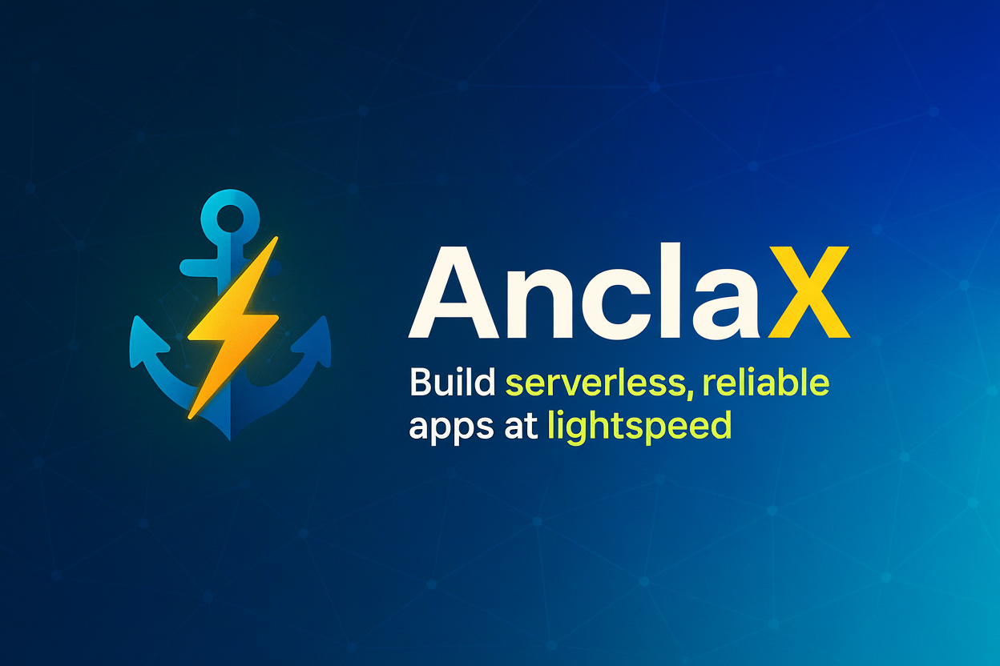

# ⚓ Anclax 

[English](README.md) | 中文



以光速 ⚡、并且更有把握 🛡️ 地构建无服务器、可靠的应用。

Anclax 是面向小到中型应用（单个 PostgreSQL）。以模式定义 API 与任务，代码生成把正确性前移到编译期。

### 亮点（Highlights）✨

- **YAML 优先 + 代码生成**：用 YAML 定义 HTTP 与任务的模式，自动生成强类型接口；缺失实现会在编译期暴露，而不是线上。
- **靠谱的异步任务**：内置至少一次投递、自动重试与 cron 调度。
- **事务安全的流程**：`WithTx` 模式确保钩子必定执行、状态一致。
- **类型化数据库层**：基于 `sqlc`，快速且安全。
- **高性能 HTTP**：基于 Fiber，易用又高效。
- **内建认证与鉴权**：基于 Macaroons 的 AuthN/AuthZ。
- **可插拔架构**：一等公民的插件系统，模块清晰、扩展容易。
- **顺手的依赖注入**：基于 Wire，显式、可测试。

### 为什么是 Anclax？它解决了什么问题 🤔

- **摆脱胶水代码**：手搓 HTTP/DB/任务/DI/Auth 容易产生隐式约定与运行时陷阱。Anclax 将契约显式化并由生成器保障。
- **任务系统不应“凑合”**：幂等、重试与投递保证并不简单。Anclax 自带至少一次语义与 cron 调度。
- **边界一致性**：用 `WithTx` 让处理器、任务与钩子保持事务性，系统不再“漏风”。
- **信心与可测性**：所有生成的接口都可 Mock；行为易于验证。

### 核心优势（Key advantages）🏆

- **编译期信心**：从模式到接口再到实现，不再“忘记写”。
- **开发效率**：`anclax init` + `anclax gen` 减少样板与手工接线。
- **可扩展性**：事件驱动与清晰的插件边界。
- **可预期性**：核心服务单例化、依赖注入清晰、生命周期明确。

## 架构 🏗️

Anclax 让你在保持可扩展、面向生产的可靠性的同时，依然能快速构建应用。

- **单一 PostgreSQL 主干**：一个 PostgreSQL 同时承担事务型业务数据与可靠的任务队列，保证状态一致并简化运维。对多数产品而言，一台配置合理的实例（如 32 vCPU）就能覆盖很长一段增长。
- **无状态应用节点**：HTTP 服务无状态，可水平扩展；可以无痛运行多个副本，无需额外协调。
- **任务队列作为解耦织网**：使用异步任务解耦模块。例如支付完成后，只需入队 `OrderFinished` 任务，并在其 handler 中执行工厂模块的写入逻辑；无需把工厂模块逻辑耦合到支付模块。
- **内置 worker，部署灵活**：Anclax 内置异步任务 worker。既可内嵌运行，也可拆分为独立的常驻 worker 进程；在无服务器平台（如 AWS Lambda）可以关闭内置 worker，仅让常驻服务承担异步任务。
- **单体而非微服务**：Anclax 倡导务实、可扩展的单体架构，并非面向千万级 QPS 的微服务编排。

这些选择让你在早期拥有极高的迭代速度，同时在演进与增长过程中保持清晰、可靠的扩展路径。

## 快速开始 🚀

```bash
go install github.com/cloudcarver/anclax/cmd/anclax@latest
anclax init . github.com/my/app
anclax gen
```

## 上手实践：现在就跑起来 🧑‍💻

```bash
# 1）在文件夹 demo 下初始化
anclax init demo github.com/you/demo

# 2）生成代码（可重复执行）
cd demo
anclax gen

# 3）启动（DB + API + worker）
docker compose up
```

在另一个终端：

```bash
curl http://localhost:2910/api/v1/counter
# 如果模板包含 auth，可选登录
curl -X POST http://localhost:2910/api/v1/auth/sign-in -H "Content-Type: application/json" -d '{"name":"test","password":"test"}'
```

## 1 分钟上手 🧭

1）定义一个接口（OpenAPI YAML）🧩

```yaml
paths:
  /api/v1/counter:
    get:
      operationId: getCounter
```

2）定义一个任务 ⏱️

```yaml
tasks:
  incrementCounter:
    description: Increment the counter value
    cron: "*/1 * * * *"
```

3）生成并实现 🛠️

```bash
anclax gen
```

```go
func (h *Handler) GetCounter(c *fiber.Ctx) error {
  return c.JSON(apigen.Counter{Count: 0})
}
```

## 功能展示：核心能力 🧰

### 基于 OpenAPI 的中间件（无需 DSL）
```yaml
x-check-rules:
  OperationPermit:
    useContext: true
    parameters:
      - name: operationID
        schema:
          type: string
  ValidateOrgAccess:
    useContext: true
    parameters:
      - name: orgID
        schema:
          type: integer
          format: int32

paths:
  /orgs/{orgID}/projects/{projectID}:
    get:
      operationId: GetProject
      security:
        - BearerAuth:
            - x.ValidateOrgAccess(c, orgID, "viewer")
            - x.OperationPermit(c, operationID)
```

### 安全方案（JWT 示例）
```yaml
components:
  securitySchemes:
    BearerAuth:
      type: http
      scheme: bearer
      bearerFormat: macaroon
```

### 异步任务：至少一次投递、重试与定时
```yaml
# api/tasks.yaml
tasks:
  - name: SendWelcomeEmail
    description: Send welcome email to new users
    parameters:
      type: object
      required: [userId, templateId]
      properties:
        userId:
          type: integer
          format: int32
        templateId:
          type: string
    retryPolicy:
      interval: 5m
      maxAttempts: 3
    cron: "0 * * * *"
```

```go
// 在事务外入队
taskID, _ := taskrunner.RunSendWelcomeEmail(ctx, &taskgen.SendWelcomeEmailParameters{
  UserId: 123, TemplateId: "welcome",
}, taskcore.WithUniqueTag("welcome-email:123"))
```

```go
// 与业务逻辑原子化入队
_ = model.RunTransactionWithTx(ctx, func(tx pgx.Tx, txm model.ModelInterface) error {
  // ... create user ...
  _, err := taskrunner.RunSendWelcomeEmailWithTx(ctx, tx, &taskgen.SendWelcomeEmailParameters{
    UserId: user.ID, TemplateId: "welcome",
  })
  return err
})
```

### 事务：用 WithTx 组合一切
```go
func (s *Service) CreateUserWithTx(ctx context.Context, tx pgx.Tx, username, password string) (int32, error) {
  txm := s.model.SpawnWithTx(tx)
  userID, err := txm.CreateUser(ctx, username, password)
  if err != nil { return 0, err }
  if err := s.hooks.OnUserCreated(ctx, tx, userID); err != nil { return 0, err }
  _, err = s.taskRunner.RunSendWelcomeEmailWithTx(ctx, tx, &taskgen.SendWelcomeEmailParameters{ UserId: userID })
  return userID, err
}
```

### Wire 依赖注入
```go
func NewGreeter(m model.ModelInterface) (*Greeter, error) { return &Greeter{Model: m}, nil }
```

```go
func InitApp() (*app.App, error) {
  wire.Build(model.NewModel, NewGreeter /* ...other providers... */)
  return nil, nil
}
```

### 基于 sqlc 的类型化 SQL
```sql
-- name: GetCounter :one
SELECT value FROM counter LIMIT 1;

-- name: IncrementCounter :exec
UPDATE counter SET value = value + 1;
```

## 运行异步任务 ⚙️

```go
// 触发 incrementCounter 任务
taskID, err := taskrunner.RunIncrementCounter(ctx, &taskgen.IncrementCounterParameters{})
if err != nil {
  // 处理错误
}
```

任务具有至少一次交付保证，并会按重试策略自动重试。你也可以在 `api/tasks.yaml` 中通过 cron 表达式进行定时调度。

## 高级：自定义初始化 🧩

你可以通过在应用启动前提供一个 `Init` 函数来执行自定义逻辑：

```go
// 在应用启动之前运行
func Init(anclaxApp *anclax_app.Application, taskrunner taskgen.TaskRunner, myapp anclax_app.Plugin) (*app.App, error) {
    if err := anclaxApp.Plug(myapp); err != nil {
        return nil, err
    }

    if _, err := anclaxApp.GetService().CreateNewUser(context.Background(), "test", "test"); err != nil {
        return nil, err
    }
    if _, err := taskrunner.RunAutoIncrementCounter(context.Background(), &taskgen.AutoIncrementCounterParameters{
        Amount: 1,
    }, taskcore.WithUniqueTag("auto-increment-counter")); err != nil {
        return nil, err
    }

    return &app.App{ AnclaxApp: anclaxApp }, nil
}
```

你也可以通过 `InitAnclaxApplication` 自定义 Anclax 应用的构建过程：

```go
func InitAnclaxApplication(cfg *config.Config) (*anclax_app.Application, error) {
    anclaxApp, err := anclax_wire.InitializeApplication(&cfg.Anclax, anclax_config.DefaultLibConfig())
    if err != nil {
        return nil, err
    }
    return anclaxApp, nil
}
```

在 `Init` 中需要额外的依赖？直接将其声明为参数（例如 `model.ModelInterface`），然后运行 `anclax gen`。

## 文档 📚

- **事务管理**：[docs/transaction.zh.md](docs/transaction.zh.md)（[English](docs/transaction.md)）
- **中间件（x-functions & x-check-rules）**：[docs/middleware.zh.md](docs/middleware.zh.md)（[English](docs/middleware.md)）
- **异步任务**：教程 [docs/async-tasks-tutorial.zh.md](docs/async-tasks-tutorial.zh.md) · 技术参考 [docs/async-tasks-technical.zh.md](docs/async-tasks-technical.zh.md)（[English](docs/async-tasks-tutorial.md), [English](docs/async-tasks-technical.md)）

## 示例 🧪

- `examples/simple` —— 一个包含 HTTP、任务、DI 与 DB 的最小端到端示例。


